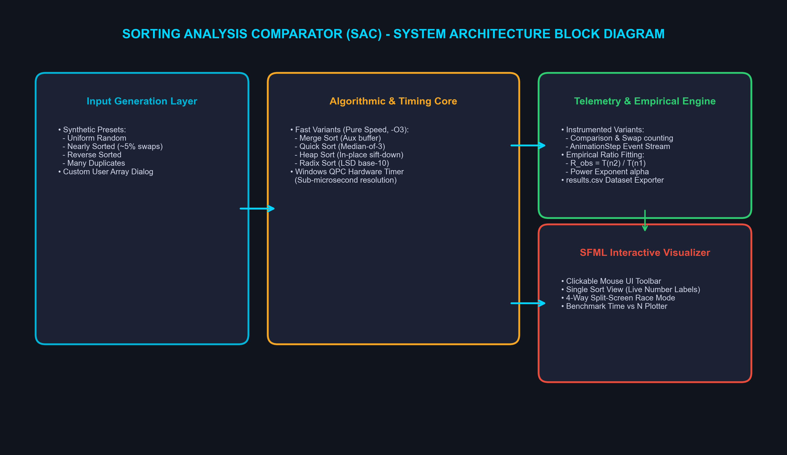
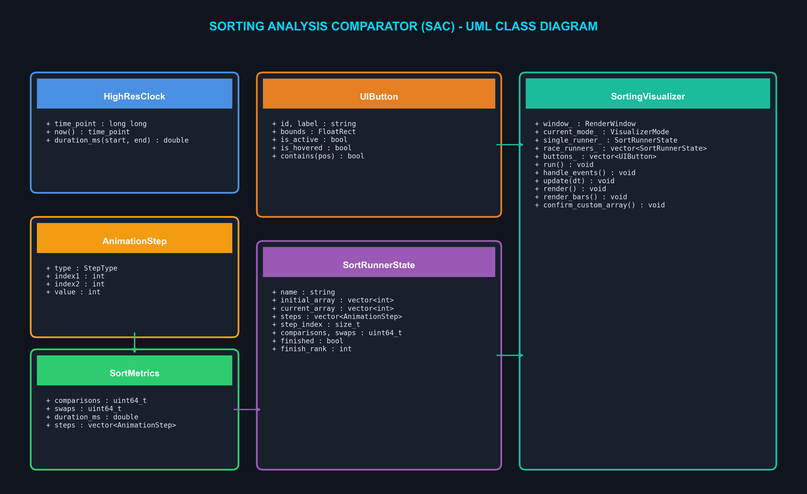
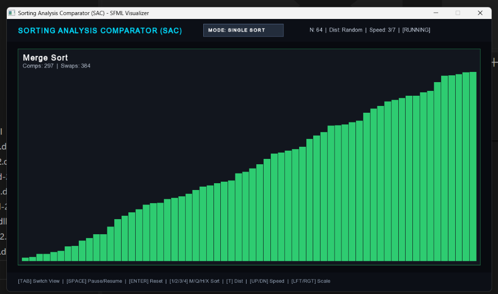
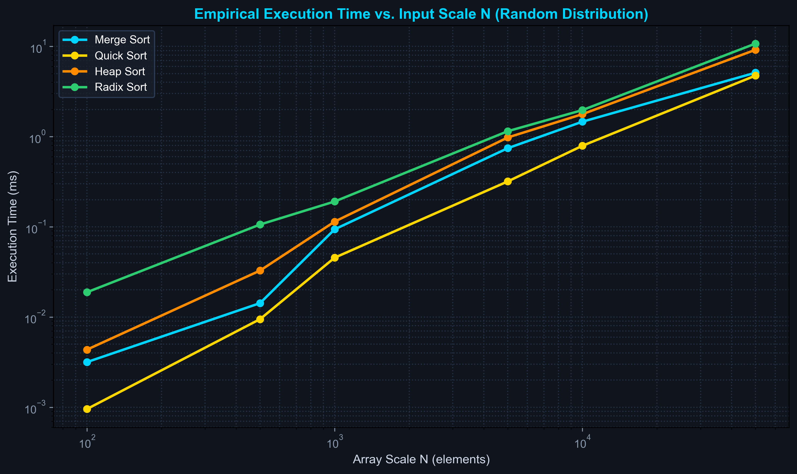

# A Project Report On SORTING ANALYSIS COMPARATOR (SAC)

**Submitted in partial fulfillment for the award of degree of**  
### Bachelor of Technology  
**Degree Of**  
### Rajasthan Technical University, KOTA  
**2026–2027**

---

### **Submitted By:**
- **Abhinav Bhatra** (Roll No: `24EJCCA009`)
- **Amit kumar** (Roll No: `24EJCCA027`)
- **Anand Gaur** (Roll No: `24EJCCA030`)

### **ITS Coordinator (CC):**
- **Mona Nagar** (Faculty Mentor)

---

**DEPARTMENT OF COMPUTER SCIENCE & ENGINEERING (ARTIFICIAL INTELLIGENCE)**  
**JAIPUR ENGINEERING COLLEGE AND RESEARCH CENTRE**  
*Shri Ram ki Nangal, via Sitapura RIICO, Tonk Road, Sukhpuria, Bambala, Jaipur, Rajasthan*

---

## TABLE OF CONTENTS

- [1. Introduction](#1-introduction)
- [2. Objective](#2-objective)
- [3. Methodology And Planning](#3-methodology-and-planning)
- [4. Literature Review](#4-literature-review)
- [5. Applications of the Project](#5-applications-of-the-project)
- [6. Block Diagram](#6-block-diagram)
- [7. UML Diagram](#7-uml-diagram)
- [8. Screenshots](#8-screenshots)
- [9. References](#9-references)
- [10. Approval of the Project](#10-approval-of-the-project)

---

## 1. Introduction
Sorting is one of the most fundamental operations in computer science, serving as an algorithmic building block for information retrieval, database indexing, computer graphics, computational geometry, and distributed big-data pipelines. An algorithm's asymptotic complexity, expressed using Big-O notation, provides a theoretical upper bound on its growth rate as input scale expands toward infinity. However, in physical computing hardware, real-world execution latency frequently deviates from pure mathematical models due to CPU cache hierarchies (L1/L2/L3), memory latency, branch prediction behavior, instruction pipelining, and data distribution topology.

The **Sorting Analysis Comparator (SAC)** is an engineering and laboratory analysis system built entirely in modern C++17 with an interactive graphical interface powered by Simple and Fast Multimedia Library (SFML 2.5). The system is engineered to bridge theoretical algorithm design and empirical runtime behavior. By benchmarking four seminal sorting paradigms—**Merge Sort** (Divide-and-Conquer), **Quick Sort** (Partitioning), **Heap Sort** (Selection via Priority Queue), and **Radix Sort** (Non-comparative Distribution)—SAC provides rigorous hardware telemetry across multiple input scales ($N = 100$ to $50,000$) and topological distributions (Uniform Random, Nearly Sorted, Reverse Sorted, and Many Duplicates).

---

## 2. Objective
1. **Empirical Complexity Verification**: Measure real execution wall-clock time with sub-microsecond hardware counters (Windows `QueryPerformanceCounter`) and determine whether observed scaling ratios $T(n_2)/T(n_1)$ align with theoretical $O(n \log n)$, $O(n^2)$, and $O(d(n+k))$ Big-O complexity predictions.
2. **Exact Operation Telemetry**: Accurately count comparisons and element swaps/assignments across identical input permutations, highlighting the invariant nature of deterministic operations independent of CPU clock fluctuations.
3. **Stress Testing Across Topologies**: Investigate algorithm resilience against pathological input distributions, specifically verifying Quick Sort's quadratic degradation on high duplicate frequency and Merge Sort's consistent performance.
4. **Interactive Multi-Paradigm Visualization**: Develop a high-performance graphical visualizer with three operational modes (Single Sort Bar Animation, 4-Way Race Mode, and Benchmark Growth Curves Plotter) and mouse-driven controls.
5. **Custom Data Tracing**: Empower students and researchers to input arbitrary integer sequences, visually verifying correctness and invariants of sorting passes with real-time on-bar numeric tracking.

---

## 3. Methodology And Planning
- **Dual-Variant Architecture**: Every sorting algorithm is implemented in two distinct variants: a Fast Variant compiled with `-O3` aggressive optimizations, preallocated buffers, and zero telemetry overhead for genuine benchmark timing; and an Instrumented Variant that records an `AnimationStep` event log alongside operation counters.
- **Hardware Sub-Microsecond Timer**: Standard MinGW GCC implementations of `std::chrono::high_resolution_clock` suffer from a 15.6 ms resolution tick floor on Windows. SAC implements an operating-system-level `HighResClock` utilizing Windows `QueryPerformanceCounter` (QPC), capturing latency down to nanosecond precision.
- **Data Generation Engine**: Four distinct stochastic generators synthesize arrays across six logarithmic scales: $N \in \{100, 500, 1000, 5000, 10000, 50000\}$. Distributions include Uniform Random (discrete uniform distribution in $[1, 100000]$), Nearly Sorted ($\sim 5\%$ random index swaps), Reverse Sorted (strictly descending), and Many Duplicates (domain $[1, 10]$).
- **Empirical Ratio & Power Fitting**: Calculates observed growth ratios $R_{obs} = T(n_2)/T(n_1)$ between successive scales and fits the empirical power exponent $\alpha = \frac{\ln(R_{obs})}{\ln(n_2/n_1)}$. $\alpha \approx 1.0$ indicates linear $O(n)$, $\alpha \approx 1.05 - 1.2$ indicates $O(n \log n)$, and $\alpha \approx 2.0$ flags quadratic $O(n^2)$.
- **SFML Render Pipeline**: An asynchronous event loop renders vertical bar geometries at 60 FPS. Operations are color-coded: Yellow for Comparisons, Red for Swaps, Purple for Overwrites/Assignments, and Emerald Green for permanently sorted elements.

---

## 4. Literature Review
- **Merge Sort (John von Neumann, 1945)**: Formulated on the divide-and-conquer strategy, Merge Sort guarantees $\Theta(n \log n)$ comparisons in all cases by recursively bisecting arrays and merging sorted subarrays. Its primary drawback is auxiliary spatial complexity $\Theta(n)$, making in-place variants challenging on memory-constrained systems.
- **Quick Sort (C. A. R. Hoare, 1959)**: Quick Sort employs in-place partitioning around a selected pivot element. While exhibiting an average time complexity of $\Theta(n \log n)$ with an exceptionally small constant factor due to cache-friendly contiguous memory scanning, naive pivot selection degrades to $O(n^2)$ when partitioning degenerates on sorted or duplicate-heavy arrays. Median-of-three pivot selection and tail-recursion elimination mitigate these risks.
- **Heap Sort (J. W. J. Williams & R. W. Floyd, 1964)**: Constructs a complete binary max-heap in $\Theta(n)$ time using bottom-up sift-down operations, followed by $n - 1$ successive root extractions in $O(\log n)$ each, achieving strict $O(n \log n)$ upper bound in-place with $O(1)$ auxiliary space.
- **Radix Sort (Herman Hollerith, 1887; Harold H. Seward, 1954)**: Radix Sort circumvents the $\Omega(n \log n)$ information-theoretic lower bound for comparison sorts by examining positional key digits using stable Counting Sort passes. Its theoretical time complexity is $\Theta(d \cdot (n + k))$, rendering it strictly linear when key length $d$ and radix base $k$ are constant.

| Algorithm | Best Case | Average Case | Worst Case | Auxiliary Space | Stability |
|---|---|---|---|---|---|
| **Merge Sort** | $O(n \log n)$ | $O(n \log n)$ | $O(n \log n)$ | $O(n)$ | Stable |
| **Quick Sort** | $O(n \log n)$ | $O(n \log n)$ | $O(n^2)$ | $O(\log n)$ | Unstable |
| **Heap Sort** | $O(n \log n)$ | $O(n \log n)$ | $O(n \log n)$ | $O(1)$ | Unstable |
| **Radix Sort** | $O(d \cdot (n + k))$ | $O(d \cdot (n + k))$ | $O(d \cdot (n + k))$ | $O(n + k)$ | Stable |

---

## 5. Applications of the Project
- **Academic Pedagogy**: Equips universities and computer science institutions with an interactive laboratory instrument that transforms abstract asymptotic recurrence relations into tangible visual and statistical telemetry.
- **Systems & Database Engineering**: Assists database engine developers in benchmarking sort-merge join operators and selecting optimal sorting heuristics based on data presortedness and cardinality.
- **Embedded Systems Constraint Profiling**: Facilitates memory-constrained runtime evaluations, proving Heap Sort's zero-allocation advantage over Merge Sort in microcontrollers.
- **Algorithmic Invariant Verification**: Enables visual tracing of loop invariants (e.g. max-heap property preservation, partition pivot boundary defense) on user-provided edge case arrays.

---

## 6. Block Diagram
The system architecture encompasses four decoupled stages: Input Generation, Algorithmic Execution, Telemetry Calculation, and SFML Graphical Visualization.

---

## 7. UML Diagram
The object-oriented design patterns, state containers, and visual rendering classes are depicted below:

---

## 8. Screenshots

### 8.1 Single Sort Bar Animation with Live Telemetry

### 8.2 Empirical Benchmark Plot: Execution Time vs. Scale N

---

## 9. References
1. Cormen, T. H., Leiserson, C. E., Rivest, R. L., & Stein, C. (2022). *Introduction to Algorithms* (4th ed.). MIT Press.
2. Knuth, D. E. (1998). *The Art of Computer Programming, Volume 3: Sorting and Searching* (2nd ed.). Addison-Wesley.
3. Sedgewick, R., & Wayne, K. (2011). *Algorithms* (4th ed.). Addison-Wesley Professional.
4. SFML Development Team. (2024). *Simple and Fast Multimedia Library Documentation (Release 2.5.1)*. https://www.sfml-dev.org/
5. ISO/IEC. (2017). *ISO/IEC 14882:2017 - Programming Languages — C++17*. International Organization for Standardization.
6. Williams, J. W. J. (1964). Algorithm 232: Heapsort. *Communications of the ACM*, 7(6), 347-348.
7. Hoare, C. A. R. (1962). Quicksort. *The Computer Journal*, 5(1), 10-16.

---

## 10. Approval of the Project

This is to certify that the project report entitled **"SORTING ANALYSIS COMPARATOR (SAC)"** submitted by **Abhinav Bhatra (24EJCCA009)**, **Amit kumar (24EJCCA027)**, and **Anand Gaur (24EJCCA030)** in partial fulfillment of the requirements for the award of the degree of **Bachelor of Technology in Computer Science & Engineering (Artificial Intelligence)** from **JAIPUR ENGINEERING COLLEGE AND RESEARCH CENTRE**, affiliated to **Rajasthan Technical University, KOTA**, is a bona fide record of the work carried out under our supervision.

The results embodied in this report have not been submitted to any other university or institute for the award of any degree or diploma.

  

_________________________ &nbsp;&nbsp;&nbsp;&nbsp;&nbsp;&nbsp;&nbsp;&nbsp;&nbsp;&nbsp;&nbsp;&nbsp;&nbsp;&nbsp;&nbsp;&nbsp;&nbsp;&nbsp;&nbsp;&nbsp;&nbsp;&nbsp;&nbsp;&nbsp;&nbsp;&nbsp;&nbsp;&nbsp;&nbsp;&nbsp;&nbsp;&nbsp;&nbsp;&nbsp;&nbsp;&nbsp;&nbsp;&nbsp;&nbsp;&nbsp;&nbsp;&nbsp;&nbsp;&nbsp;&nbsp;&nbsp;&nbsp;&nbsp;&nbsp;&nbsp;&nbsp;&nbsp;&nbsp;&nbsp;&nbsp;&nbsp; _________________________  
**Mona Nagar** &nbsp;&nbsp;&nbsp;&nbsp;&nbsp;&nbsp;&nbsp;&nbsp;&nbsp;&nbsp;&nbsp;&nbsp;&nbsp;&nbsp;&nbsp;&nbsp;&nbsp;&nbsp;&nbsp;&nbsp;&nbsp;&nbsp;&nbsp;&nbsp;&nbsp;&nbsp;&nbsp;&nbsp;&nbsp;&nbsp;&nbsp;&nbsp;&nbsp;&nbsp;&nbsp;&nbsp;&nbsp;&nbsp;&nbsp;&nbsp;&nbsp;&nbsp;&nbsp;&nbsp;&nbsp;&nbsp;&nbsp;&nbsp;&nbsp;&nbsp;&nbsp;&nbsp;&nbsp;&nbsp;&nbsp;&nbsp;&nbsp;&nbsp;&nbsp;&nbsp;&nbsp;&nbsp;&nbsp;&nbsp;&nbsp;&nbsp;&nbsp;&nbsp;&nbsp;&nbsp;&nbsp;&nbsp;&nbsp;&nbsp;&nbsp;&nbsp;&nbsp;&nbsp;&nbsp;&nbsp; **Head of Department (HOD)**  
*ITS Coordinator (CC)* &nbsp;&nbsp;&nbsp;&nbsp;&nbsp;&nbsp;&nbsp;&nbsp;&nbsp;&nbsp;&nbsp;&nbsp;&nbsp;&nbsp;&nbsp;&nbsp;&nbsp;&nbsp;&nbsp;&nbsp;&nbsp;&nbsp;&nbsp;&nbsp;&nbsp;&nbsp;&nbsp;&nbsp;&nbsp;&nbsp;&nbsp;&nbsp;&nbsp;&nbsp;&nbsp;&nbsp;&nbsp;&nbsp;&nbsp;&nbsp;&nbsp;&nbsp;&nbsp;&nbsp;&nbsp;&nbsp;&nbsp;&nbsp;&nbsp;&nbsp;&nbsp;&nbsp;&nbsp;&nbsp;&nbsp;&nbsp;&nbsp;&nbsp;&nbsp;&nbsp;&nbsp;&nbsp;&nbsp;&nbsp;&nbsp; *Department of CSE (AI)*  
*JECRC, Jaipur* &nbsp;&nbsp;&nbsp;&nbsp;&nbsp;&nbsp;&nbsp;&nbsp;&nbsp;&nbsp;&nbsp;&nbsp;&nbsp;&nbsp;&nbsp;&nbsp;&nbsp;&nbsp;&nbsp;&nbsp;&nbsp;&nbsp;&nbsp;&nbsp;&nbsp;&nbsp;&nbsp;&nbsp;&nbsp;&nbsp;&nbsp;&nbsp;&nbsp;&nbsp;&nbsp;&nbsp;&nbsp;&nbsp;&nbsp;&nbsp;&nbsp;&nbsp;&nbsp;&nbsp;&nbsp;&nbsp;&nbsp;&nbsp;&nbsp;&nbsp;&nbsp;&nbsp;&nbsp;&nbsp;&nbsp;&nbsp;&nbsp;&nbsp;&nbsp;&nbsp;&nbsp;&nbsp;&nbsp;&nbsp;&nbsp;&nbsp;&nbsp;&nbsp;&nbsp;&nbsp;&nbsp;&nbsp;&nbsp;&nbsp;&nbsp; *JECRC, Jaipur*  

 

**Date:** ___________________  
**Place:** Jaipur
